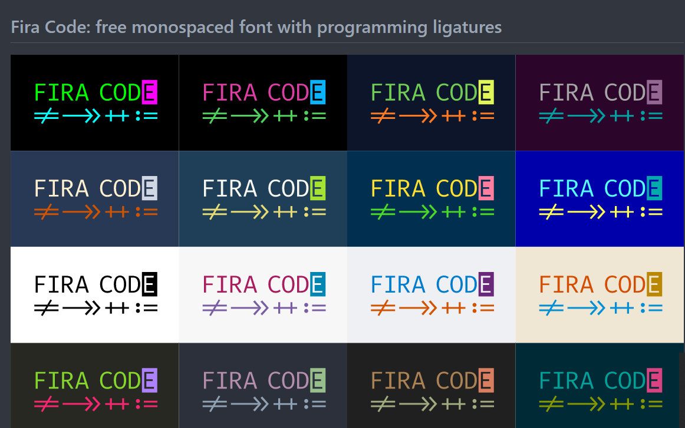

# Notas-Programacion

## librerías

###  i18next

- **Simplicidad:** no es necesario cambiar la configuración de su paquete web o agregar transpiladores adicionales de babel, solo use create-react-app y listo.
- **Listo para producción** , sabemos que hay más necesidades de producción que simplemente hacer i18n en el lado del cliente, por lo que también ofrecemos un soporte más amplio en el [lado](https://www.i18next.com/supported-frameworks.html) del [servidor](https://www.i18next.com/supported-frameworks.html) (nodejs, php, ruby, .net, ...). **Aprende una vez, traduce a todas partes** .
- **Beyond i18n** viene con [locize que](https://locize.com/) cierra la brecha entre el desarrollo y las traducciones, cubriendo todo el proceso de traducción.
- https://github.com/i18next/react-i18next

# react-beautiful-dnd 

## Características centrales

- [Movimiento](https://github.com/atlassian/react-beautiful-dnd/blob/master/docs/about/animations.md) hermoso y [natural](https://github.com/atlassian/react-beautiful-dnd/blob/master/docs/about/animations.md) de artículos💐

- [Accesible](https://github.com/atlassian/react-beautiful-dnd/blob/master/docs/about/accessibility.md) : potente soporte de teclado y lector de pantalla♿️

- [Extremadamente eficiente](https://github.com/atlassian/react-beautiful-dnd/blob/master/docs/support/media.md) 🚀

- API limpia y potente que es fácil de comenzar

- Juega extremadamente bien con interacciones estándar del navegador

- [Estilo sin piniones](https://github.com/atlassian/react-beautiful-dnd/blob/master/docs/guides/preset-styles.md)

- Sin creación de nodos dom de contenedor adicionales: ¡Flexbox y gestión de foco amigables!

- ejemplo https://react-beautiful-dnd.netlify.app/iframe.html?id=board--simple

  

  

https://github.com/atlassian/react-beautiful-dnd

## Documentaciones

https://majoledesma.github.io/react-apuntes/

https://majoledesma.github.io/js-notes/

[https://github.com/JasanHdz/backendnodejs/tree/master/notes#creaci%C3%B3n-de-test-para-nuestros-endpoints](https://github.com/JasanHdz/backendnodejs/tree/master/notes#creación-de-test-para-nuestros-endpoints)

[https://platzi.com/tutoriales/1548-react/4065-guia-para-usar-github-pages-en-tus-proyectos-de-reactjs/](https://slack-redir.net/link?url=https%3A%2F%2Fplatzi.com%2Ftutoriales%2F1548-react%2F4065-guia-para-usar-github-pages-en-tus-proyectos-de-reactjs%2F)   

[https://medium.com/@Dragonza/react-router-problem-with-gh-pages-c93a5e243819](https://slack-redir.net/link?url=https%3A%2F%2Fmedium.com%2F%40Dragonza%2Freact-router-problem-with-gh-pages-c93a5e243819) 

## Apis

https://any-api.com/

https://jsonplaceholder.typicode.com/

https://reqres.in/

https://developers.themoviedb.org/3/getting-started/introduction

# links utiles

https://carbon.now.sh/

https://remix.run/

# extenciones vscode

https://marketplace.visualstudio.com/items?itemName=kisstkondoros.vscode-codemetrics

[https://marketplace.visualstudio.com/items?itemName=oderwat.indent-rainbow](https://slack-redir.net/link?url=https%3A%2F%2Fmarketplace.visualstudio.com%2Fitems%3FitemName%3Doderwat.indent-rainbow)

[https://marketplace.visualstudio.com/items?itemName=humao.rest-client](https://slack-redir.net/link?url=https%3A%2F%2Fmarketplace.visualstudio.com%2Fitems%3FitemName%3Dhumao.rest-client)

[https://github.com/tonsky/FiraCode](https://slack-redir.net/link?url=https%3A%2F%2Fgithub.com%2Ftonsky%2FFiraCode)

[https://marketplace.visualstudio.com/items?itemName=EditorConfig.EditorConfig](https://slack-redir.net/link?url=https%3A%2F%2Fmarketplace.visualstudio.com%2Fitems%3FitemName%3DEditorConfig.EditorConfig)

[https://marketplace.visualstudio.com/items?itemName=TabNine.tabnine-vscode](https://slack-redir.net/link?url=https%3A%2F%2Fmarketplace.visualstudio.com%2Fitems%3FitemName%3DTabNine.tabnine-vscode)    

[https://marketplace.visualstudio.com/items?itemName=eamodio.gitlens](https://slack-redir.net/link?url=https%3A%2F%2Fmarketplace.visualstudio.com%2Fitems%3FitemName%3Deamodio.gitlens)    

[https://marketplace.visualstudio.com/items?itemName=EliverLara.andromeda](https://slack-redir.net/link?url=https%3A%2F%2Fmarketplace.visualstudio.com%2Fitems%3FitemName%3DEliverLara.andromeda) 

[https://marketplace.visualstudio.com/items?itemName=webrender.synthwave-x-fluoromachine](https://slack-redir.net/link?url=https%3A%2F%2Fmarketplace.visualstudio.com%2Fitems%3FitemName%3Dwebrender.synthwave-x-fluoromachine)[https://github.com/kencrocken/FiraCodeiScript](https://slack-redir.net/link?url=https%3A%2F%2Fgithub.com%2Fkencrocken%2FFiraCodeiScript) 

 [https://github.com/deepanrajkumar/Italic-and-Ligature](https://slack-redir.net/link?url=https%3A%2F%2Fgithub.com%2Fdeepanrajkumar%2FItalic-and-Ligature) [http://ngserve.blogspot.com/2018/04/como-desplegar-una-aplicacion-angular.html](https://slack-redir.net/link?url=http%3A%2F%2Fngserve.blogspot.com%2F2018%2F04%2Fcomo-desplegar-una-aplicacion-angular.html)

